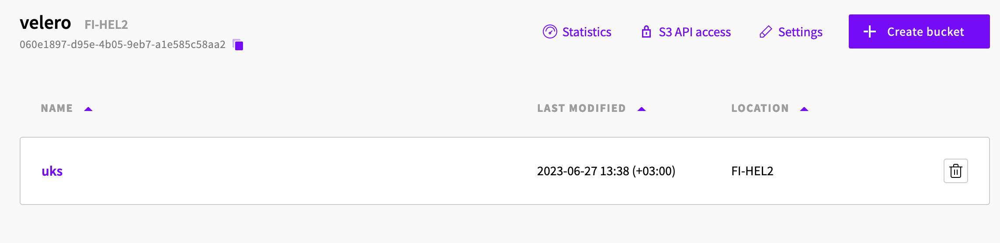

# Backup of UpCloud Kubernetes Service with Velero

This is an example on how to create an [UpCloud Object Storage](https://upcloud.com/products/object-storage) instance and a bucket with Terraform, and how to install and configure [Velero](https://velero.io/) for Kubernetes backup.  

## Prerequisites

In addition to a [working UKS Cluster](https://upcloud.com/products/managed-kubernetes), you will need these tools to be installed:

* terraform
* make
* kubectl
* [velero cli](https://velero.io/docs/main/basic-install/#install-the-cli)

To create the resources with Terraform and install Velero, you will need your API credentials and Kubeconfig file exported as environment variables.

```text
export UPCLOUD_USERNAME=your_username
export UPCLOUD_PASSWORD=your_password
export KUBECONFIG=your_kubeconfig_file
```

You must also create a `config.tfvars` file with your own settings in the `terraform` folder:

```text
name            = "velero"
zone            = "fi-hel2"
bucket_size     = 250
bucket_name     = "uks"
access_key      = "test"
secret_key      = "testkey123"
```

## Deploy UpCloud Object Storage

Velero needs an S3 compatible object storage to upload the backup files to. We will be using the UpCloud Object Storage service for this. In addition, Velero supports CSI based snapshots for Persistent Volume backups. These backup snapshots won't be stored in the S3 bucket, they will remain in the storage system and therefore limits the restore to the same zone where the initial backup was taken. UpCloud MaxIOPS supports snapshosts and our [CSI driver](https://github.com/UpCloudLtd/upcloud-csi) fully supports the feature.

Initiate the project and install required Terraform providers.

```text
make init
```

The object storage and a bucket can now be created with Terraform. We will create the necessary object storage components, and build a Velero install script with the configuration details. The steps should be done in less than 5 minutes.

First, create a plan and see all the resources Terraform is about to create:

```text
make plan
```

Then apply the changes:

```text
make apply
```

A file called `terraform/velero-install.sh` will be created. This file is needed in the next step to install Velero.

## Deploy Velero

You can run the installation script `terraform/velero-install.sh` as-is, or you can run the individual commands yourself if you want to see more details on what the installation involves. First it will install Velero components to the UpCloud Kubernetes Service cluster, and then it adds the necessary plugin for CSI. Lastly, the volumesnapshotclass needs to be labeled with a Velero tag to make Velero aware of the feature.

Kick off the installation script:

```text
cd terraform
./velero-install.sh
```

Velero should be installed in a few seconds. You can check the installation logs in the Velero pod. You should see a successful connection to the S3 bucket:

```text
kubectl logs -n velero velero-pod-name
```

Now we are ready to deploy a test app on the cluster!

## Deploy a Test App

Our test app is a simple nginx pod. We use a Persistent Volume for the nginx logs, so we can follow site loads and see if our backup and restore works. View the app yaml for more information. Velero is also capable of doing pre- and posthooks for both backups and restores. The test app has an example on how to run scripts before and after a backup is run.

```text
cat k8s/velero-demo-app.yaml
```

Deploy the app:

```text
kubectl apply -f k8s/velero-demo-app.yaml
```

Once the load balancer service is up, load the default nginx welcome page:

```text
kubectl get services -n velero-demo
curl -i lb-yourlbdnsname-1.upcloudlb.com
```

Verify that you can see the webpage loads in nginx logs. The logs are stored on a Persistent Volume:

```text
kubectl exec -n velero-demo nginx-pod-name -it -- cat /var/log/nginx/access.log
```

Now we are ready to create a backup! Note the time stamp on the nginx logs, so you can verify the backup and restore worked as expected. We are using a label to select the test app pod and PVC, but Velero can also backup the whole velero-demo namespaces or even the whole cluster.

```text
velero backup create velerotest1 --selector app=velero-app 
```

Let's reload the nginx welcome page a few times to get more data. Remember, we created the backup point-in-time before these log messages.

```text
curl -i lb-yourlbdnsname-1.upcloudlb.com
kubectl exec -n velero-demo nginx-pod-name -it -- cat /var/log/nginx/access.log
```

We have data in the logs, and our backup has completed. Let's delete the test app deployment and PVC and see if we can do a successful restore:

```text
kubectl delete deployments.apps -n velero-demo nginx
kubectl delete pvc -n velero-demo nginx-logs
```

The app is now gone, so let's do a restore.

```text
velero restore create --from-backup velerotest1
```

The restore should be done in a couple of minutes. Verify that you can still access the nginx welcome page:

```text
curl -i lb-yourlbdnsname-1.upcloudlb.com
```

Lastly, let's see what log entries we have left:

```text
kubectl exec -n velero-demo nginx-pod-name -it -- cat /var/log/nginx/access.log
```

You should have the original logs created before backup, and the latest logs from the page load after restore!

You can also view all the backup and restore files directly in the S3 Bucket:

* Go to [UpCloud](https://upcloud.com), login and go to `Object Storage`
* Click on `velero` Object Storage and select the `uks` bucket
* Feel free to poke around the file system and see the backup and restore files


