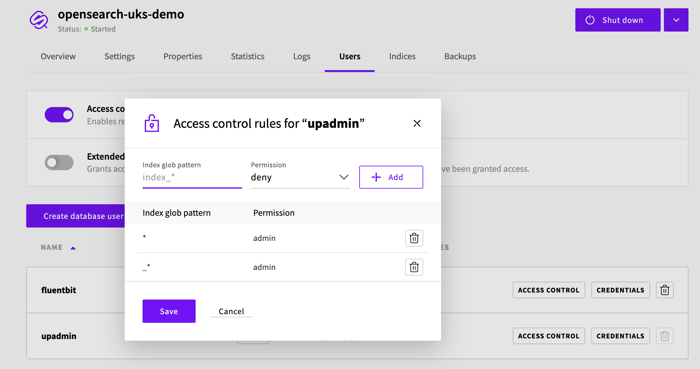
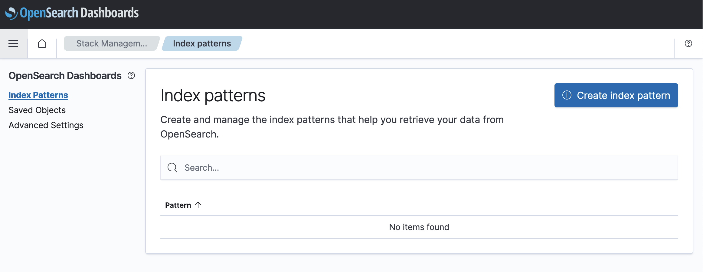

# UpCloud Kubernetes Service with Fluent-bit and OpenSearch Integration

This is an example on how to create an [OpenSearch](https://upcloud.com/resources/tutorials/getting-started-with-opensearch) database using UpCloud Managed Databases and Terraform, and how to configure the [UpCloud Kubernetes Service](https://upcloud.com/products/managed-kubernetes) to ship all log files to the database using Fluent-bit.  

## Prerequisites

In addition to a [working UKS Cluster](https://upcloud.com/products/managed-kubernetes), you will need these tools to be installed:

* terraform
* make
* helm

To create the resources with Terraform and install Fluent-bit, you will need your API credentials and Kubeconfig file exported as environment variables.

```
export UPCLOUD_USERNAME=your_username
export UPCLOUD_PASSWORD=your_password
export KUBECONFIG=your_kubeconfig_file
```

You must also create a `config.tfvars` file with your own settings in the `terraform` folder:

```
zone = "fi-hel2"
opensearch_plan = "1x2xCPU-4GB-80GB-1D""
```

## Deploy OpenSearch

Fluent-bit needs a destination for the log files, in this case we will be using [UpCloud Managed OpenSearch](https://upcloud.com/resources/tutorials/getting-started-with-opensearch) database. 

Initiate the project and install required Terraform providers.

```
make init
```

The database can now be created with Terraform. We will create an OpenSearch database with the given configuration, and produce a configuration file for Fluent-bit with the installation details. The database should be done in less than 10 minutes.

First, create a plan and see all the resources Terraform is about to create:

```
make plan
```

Then apply the changes:

```
make apply
```

A file called `terraform/opensearch-fluentbit-helm-values.yaml` will be created, and we will need this file to configure Fluent-bit to send all the logs to our OpenSearch instance.

## Deploy Fluent-bit

To start, add the Fluent-bit repo to helm:

```
helm repo add fluent https://fluent.github.io/helm-charts
```

Finally, install Fluent-bit to `fluent-bit` namespace:

```
helm install --repo https://fluent.github.io/helm-charts fluent-bit --values terraform/opensearch-fluentbit-helm-values.yaml --namespace fluent-bit --create-namespace fluent-bit
```

If you want to further modify your fluent-bit configuration, please refer to the [chart documentation](https://github.com/fluent/helm-charts/blob/main/charts/fluent-bit/values.yaml). You can copy the generated values file to another location and add your changes to it.

## Configure Users and View Logs

The logs are now flowing to the OpenSearch instance. The database was created with Access Control ON to ensure proper security, and by default this means that only the `fluentbit` user has read and write access to the `uks` index. If you want to view the log information in OpenSearch Dashboard, you will need to give `upadmin` user sufficient access:

- Go to [UpCloud](https://upcloud.com), login and go to `Databases`
- Open the created database and click on `Users` tab
- Modify the `upadmin` user by clicking `ACCESS CONTROL` and give the user admin rights.



Navigate back to `Overview` tab, copy the `upadmin` password and click `Go to dashboard`.

Navigate to either `Discovery` or `Stack Management`, and click on `Create index pattern`. Filter with `uks*` and create the index using `@timestamp`. The data should now be visible in the Discovery section!


