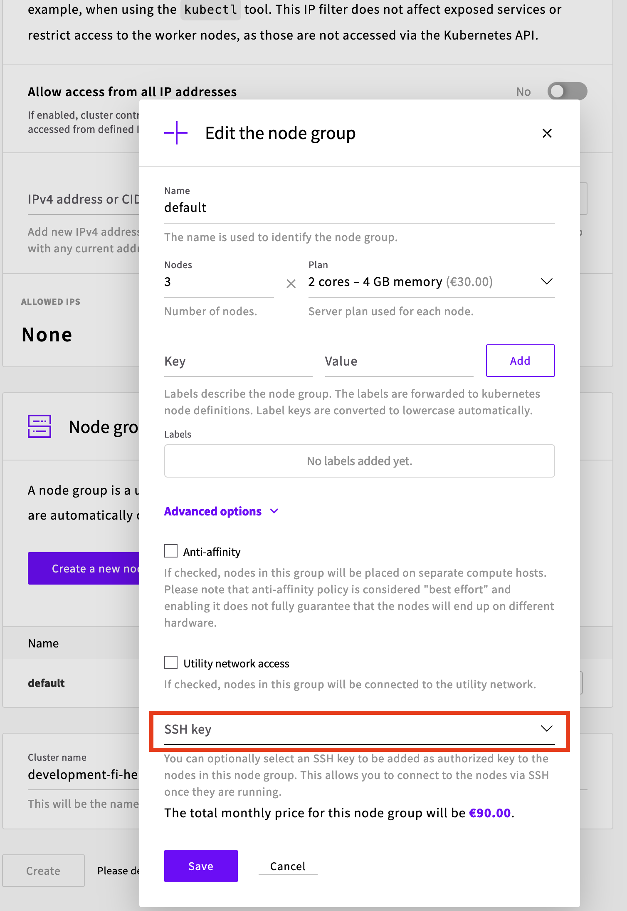

# UpCloud Kubernetes Service with OpenEBS NFS Provisioner

 [UpCloud Kubernetes Service (UKS)](https://upcloud.com/products/managed-kubernetes) supports Read-Write-Once (RWO) Persistent Volume out of the box. However, for use cases where Read-Write-Many (RWX) Persistent Volumes are needed, OpenEBS provides a good alternative. [OpenEBS with NFS Provisioner](https://github.com/openebs/dynamic-nfs-provisioner/blob/develop/docs/intro.md) can utilize the existing RWO volumes, and expose them through automatically created NFS server as RWX volumes. This guide goes through the implementation steps required to make OpenEBS functional on top of UKS.

## Prerequisites

Start by building your UKS cluster. You will need SSH access to the worker nodes, so remember to add your SSH keys to the Worker Nodes!



In addition to a UKS cluster, you will need `helm` to be installed and configured.

The UKS worker nodes need to be prepared before OpenEBS can provision RWX compatible Persistent Volumes. OpenEBS requires that the nodes are configured with an NFS client. UKS Worker nodes do not have NFS client built-in for now, so they need to be installed manually. Note that the Worker Node image might be recreated in certain circumstances, like in node pool modifications, and the NFS client will need to be reinstalled.

SSH into all the Worker Nodes, and run the following command on all of them to install the required software:

```
sudo apt install nfs-common -y
```

## Installation

Installing OpenEBS is very easy, just run the following `helm` commands:

```
helm repo add openebs https://openebs.github.io/charts
helm repo update
helm install openebs openebs/openebs -n openebs --create-namespace --set nfs-provisioner.enabled=true
```

The last thing to do is the create a Storage Class for RWX volumes that configures the NFS Provisioner and adds the standard UKS Storage Class `upcloud-block-storage-maxiops` as the backend Storage Class which is used to provision the underlying RWO volumes:

```
kubectl apply -f nfs-storageclass.yaml
```

## Testing

Run the `demo-app.yaml` file to test the implementation. The yaml file creates 2 Deployments, 1 RWX Persistent Volume Claim and 1 ConfigMap. The ConfigMap contains a script that creates a file each second for 5 minutes to a folder that is supported by the RWX PVC. 

```
kubectl apply -f demo-app.yaml
```

Once the Deployments are running, you should see two types of files being created in the `/tmp` folder: one for demo-app-1 and one for demo-app-2. List the files of the `/tmp` folder on each pod, both of the pods should have the same content. Note that the files are being created each second so depending when you list the files, there could be a slight difference between the folders.

```
kubectl exec deployment/demo-app-1 -it -- ls -lt /tmp
kubectl exec deployment/demo-app-2 -it -- ls -lt /tmp
```